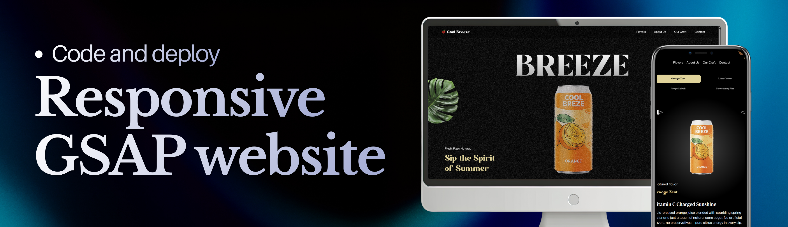
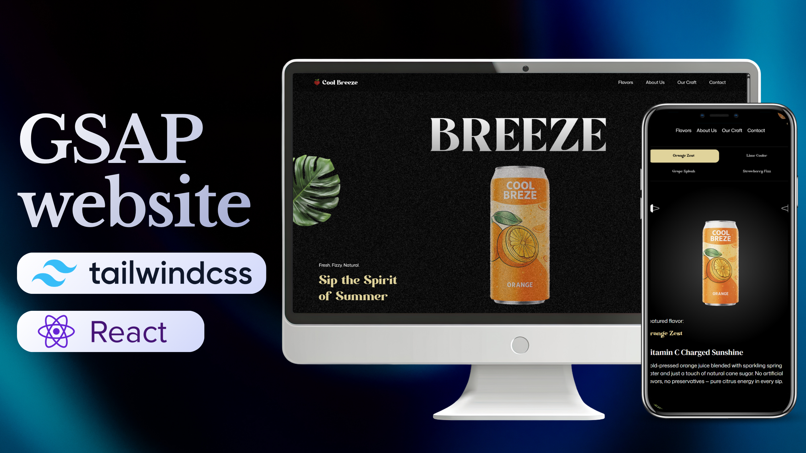

<div align="center">
  <br />
  
  <br />

  <div>
    
    
    
    
  </div>

  <h3 align="center">Cool Breeze — Website with GSAP Animations</h3>

  <div align="center">
    A natural beverage made by Peruvian students 🇵🇪🍹
  </div>
</div>

## 📋 Table of Contents

1. 🤖 [Introduction](#introduction)
2. 🎓 [Tutorial Credits](#credits)
3. ⚙️ [Tech Stack](#tech-stack)
4. 🔋 [Features](#features)
5. ✨ [My Contributions to the Project](#my-contributions)
6. 🤸 [Quick Start](#quick-start)
7. 🔗 [Assets](#assets)

## <a name="introduction">🤖 Introduction</a>

Cool Breeze is the website for a natural beverage made by Peruvian students. It's a modern, immersive experience built with React, GSAP, and Tailwind CSS, featuring scroll-triggered animations, video playback synced to scroll position, and a fully responsive, mobile-first design.

## <a name="credits">🎓 Tutorial Credits</a>

This project is based on the tutorial **[Master Web Animations in 2 Hours | Build an Awwwards-Level Website](https://youtu.be/AW1yfBKRMKc)** by **[JavaScript Mastery](https://www.youtube.com/@javascriptmastery/videos)**. All credit for the base structure, GSAP animation logic, and the original project approach goes to their team. Thanks for the great content!

Starting from that foundation, I adapted the project to the **Cool Breeze** brand and added my own improvements (detailed below).

## <a name="tech-stack">⚙️ Tech Stack</a>

- **[GSAP](https://gsap.com/)** — dynamic scroll-driven animations: SplitText, ScrollTrigger, parallax, pinned sections, scroll-synced video playback, and a custom animated carousel.
- **[React](https://react.dev/)** — component structure for modular development and seamless animation integration.
- **[Tailwind CSS](https://tailwindcss.com/)** — utility-first framework for agile, consistent design.
- **[Vite](https://vitejs.dev/)** — lightning-fast dev server and build tool.
- **[Cloudinary](https://cloudinary.com/)** — image/video hosting and optimization to improve production performance.

## <a name="features">🔋 Features</a>

👉 **SplitText Animations**: high-impact text reveals for intros and highlighted sections.

👉 **ScrollTrigger Effects**: scroll-based timeline control and animations.

👉 **Parallax Scrolling**: immersive depth that responds to user scroll.

👉 **Pinned Sections**: animated content while the section stays locked in view.

👉 **Scroll-Synced Video Playback**: video progress follows scroll position.

👉 **Image Masking Effects**: eye-catching visual transitions triggered by scroll.

👉 **Custom Carousel**: fully custom navigation and animated slides.

👉 **Seamless Cross-Section Timelines**: coordinated animations throughout the page.

👉 **Responsive, Mobile-First Design**: the UI adapts fluidly to any screen size, prioritizing the mobile experience.

## <a name="my-contributions">✨ My Contributions to the Project</a>

Building on the tutorial's foundation, I made the following improvements:

- 🎨 **Frontend redesign**: visual adjustments for a more modern style consistent with the Cool Breeze brand identity.
- 🖼️ **Custom hero and thumbnail**: designed a new main hero image and a new thumbnail for the project.
- ⚡ **Deploy performance optimization**: integrated Cloudinary to serve optimized images and videos, fixing loading and performance issues in production.
- 📱 **Mobile-first approach**: reviewed and improved the responsive experience so the site works optimally on mobile devices before desktop.
- 🥤 **Brand adaptation**: customized content, copy, and images to represent Cool Breeze, a natural beverage made by Peruvian students.

## <a name="quick-start">🤸 Quick Start</a>

Follow these steps to run the project locally.

**Prerequisites**

- [Git](https://git-scm.com/)
- [Node.js](https://nodejs.org/en)
- [npm](https://www.npmjs.com/)

**Cloning the repository**

```bash
git clone <YOUR_REPOSITORY_URL>
cd <repository-name>
```

**Installation**

```bash
npm install
```

**Running the project**

```bash
npm run dev
```

Open [http://localhost:5173](http://localhost:5173) in your browser to view the project.

## <a name="assets">🔗 Assets</a>

The hero image and thumbnail in this README were designed specifically for Cool Breeze:

<div align="center">
  
</div>